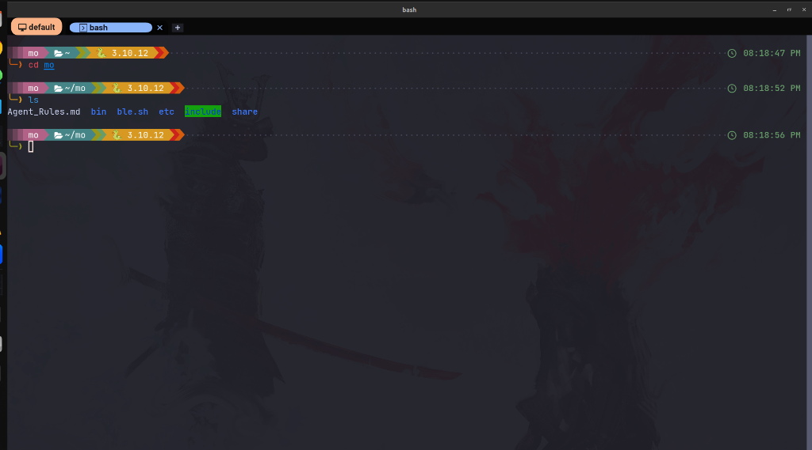

# WezTerm & Starship Ultimate Theme 🚀

A highly professional, deeply customized terminal environment for Ubuntu. It features a Gruvbox-inspired rich color palette, context-aware modules, and dynamic random colors for the prompt arrow!



## ✨ Features

- **Deep, Rich Colors:** Carefully selected jewel tones (Deep Ruby, Royal Blue, Forest Green) instead of harsh neon colors.
- **Dynamic Random Arrow:** The prompt arrow (`╰─❯`) changes color on *every single command* using an embedded `.bashrc` hook, providing a fresh look constantly!
- **Context-Aware Modules:** 
  - **Git:** Shows your branch only when inside a repository.
  - **Python, Node, Docker, K8s:** Automatically detects and displays active environments beautifully.
- **Rounded Powerline:** Uses soft rounded bubbles (`` and ``) for a modern aesthetic.

## 📥 Installation

This repository comes with an automated installation script designed for **Ubuntu/Debian**. It will safely backup your existing configurations before applying the new theme.

### One-Command Install
```bash
git clone https://github.com/BN-Nasser/ultimate-terminal-theme.git
cd ultimate-terminal-theme
chmod +x install.sh
./install.sh
```
> **Note:** The script will automatically install WezTerm, Starship, and the required JetBrainsMono Nerd Font.

## 🛠️ What's Included?

- `config/starship.toml`: The core Starship configuration file.
- `config/wezterm/`: The configuration files for the WezTerm emulator.
- `bashrc_hook.sh`: The logic for the dynamic random arrow color generation.
- `install.sh`: The automated deployment script.

## 📝 Customization

If you want to change the colors of the random arrow, you can edit the `colors` array inside the `_update_random_arrow` function in your `~/.bashrc` file using standard TrueColor RGB values (e.g., `204;36;29`).

---
*Built with ❤️ for a better terminal experience.*
